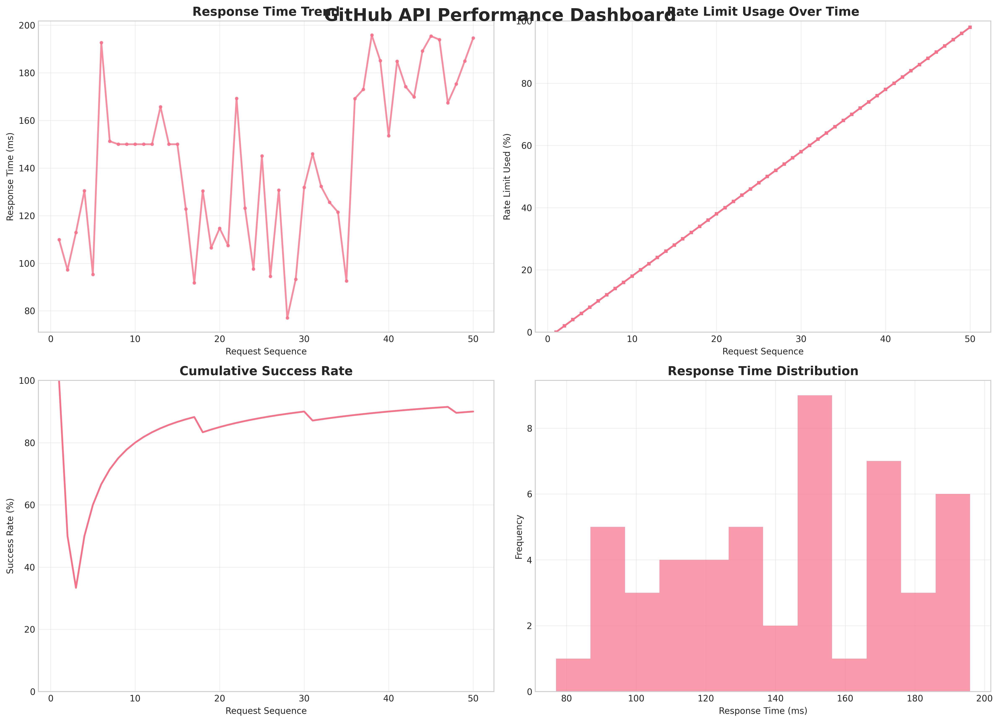
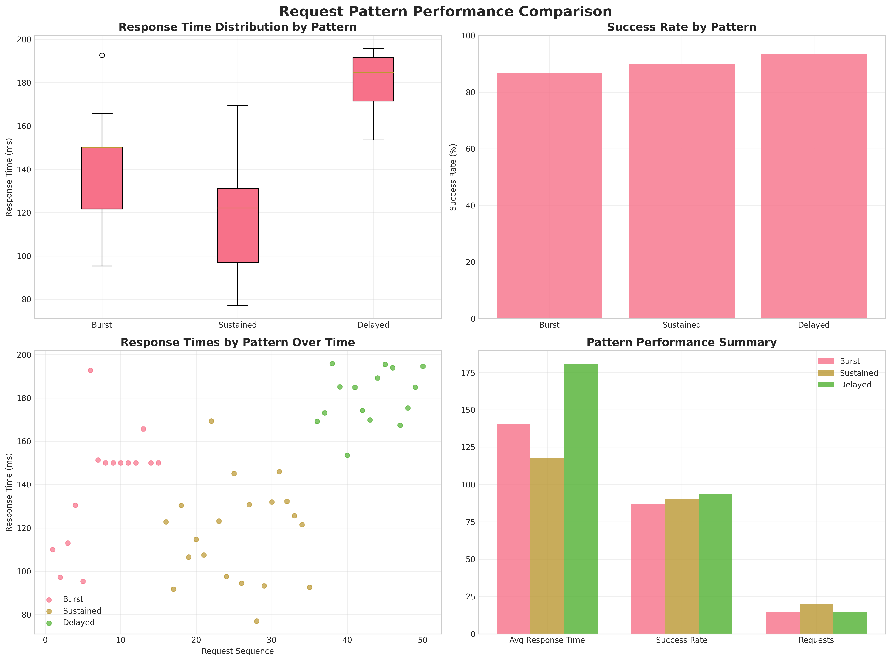
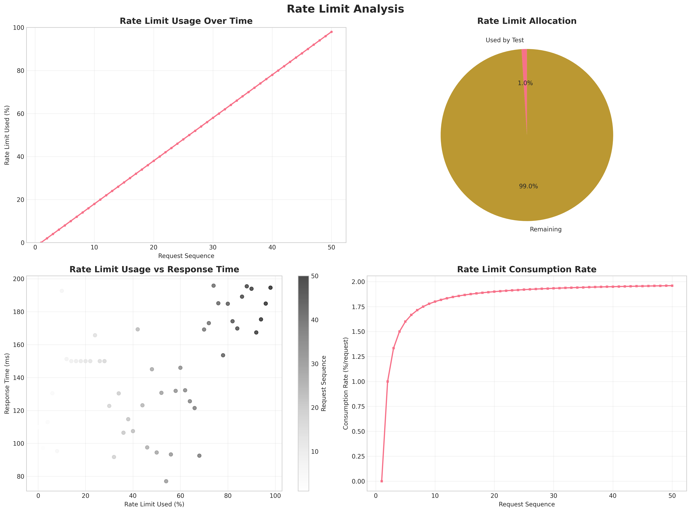
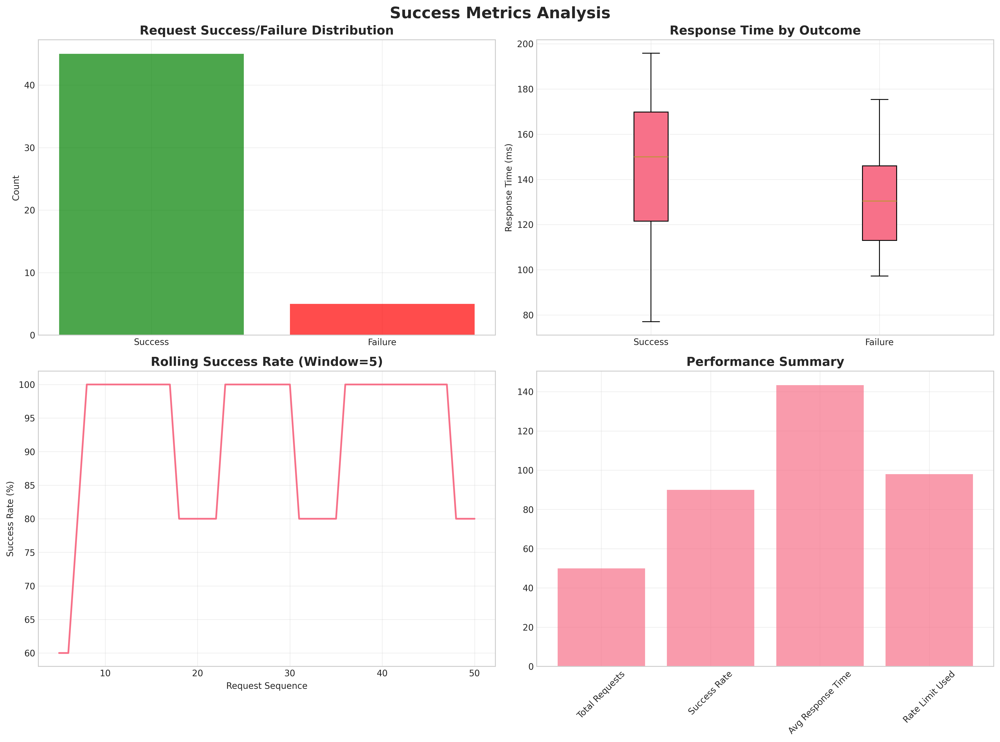

# 🚀 GitHub API Rate Limit Tester

<div align="center">


*A comprehensive Python tool for testing and analyzing GitHub API rate limits and response patterns* 📊

</div>

## 📋 Overview

**GitHub API Rate Limit Tester** is a powerful Python tool designed to help developers understand GitHub's API behavior under different request patterns. Whether you're building applications that interact with GitHub or simply want to understand rate limiting, this tool provides comprehensive insights through automated testing and beautiful visualizations.

### 🎯 Key Features

- **🔍 Multiple Request Patterns**: Test burst, sustained, and delayed request patterns
- **📊 Comprehensive Metrics**: Track response times, status codes, and rate limit headers
- **📈 Data Visualization**: Generate professional charts showing request patterns and response times
- **📋 Detailed Analysis**: Calculate success rates, performance metrics, and rate limit usage
- **💾 Export Results**: Save raw data to CSV and generate summary reports

## 🖼️ Visualizations

### Performance Dashboard

*Comprehensive overview of API performance including response time trends, rate limit usage, success rates, and response time distribution.*

### Pattern Comparison

*Comparison of different request patterns showing response time distributions, success rates, and performance metrics across burst, sustained, and delayed patterns.*

### Rate Limit Analysis

*Detailed analysis of rate limit usage over time, allocation breakdown, and consumption patterns.*

### Success Metrics

*Comprehensive success analysis including request outcomes, response time by success/failure, and performance summaries.*

## 🚀 Quick Start

### Installation

1. **Clone the repository**
   ```bash
   git clone https://github.com/0reilly/github-api-rate-limit-tester.git
   cd github-api-rate-limit-tester
   ```

2. **Install dependencies**
   ```bash
   pip install -r requirements.txt
   ```

3. **Set up your environment**
   ```bash
   export GITHUB_TOKEN=your_github_token_here
   ```

### Basic Usage

Run the comprehensive test suite:
```bash
python3 github_api_tester_clean.py
```

### Advanced Usage

For custom testing patterns:
```python
from github_api_tester import GitHubAPITester

# Initialize with your GitHub token
token = "your_github_token_here"
tester = GitHubAPITester(token)

# Test different patterns
tester.test_burst_pattern(num_requests=10)
tester.test_sustained_pattern(num_requests=20, interval=0.5)
tester.test_delayed_pattern(num_requests=15, initial_delay=1.0, delay_increment=0.5)

# Analyze and visualize results
analysis = tester.analyze_results()
tester.create_visualizations()
tester.generate_report(analysis)
```

## 📊 Test Patterns Explained

### 1. 🚀 Burst Pattern
- **Purpose**: Tests how the API handles sudden spikes in traffic
- **Behavior**: Makes multiple requests in rapid succession
- **Use Case**: Simulating user actions or automated scripts
- **Insights**: Identifies immediate rate limiting behavior

### 2. ⏱️ Sustained Pattern
- **Purpose**: Tests consistent, regular API usage
- **Behavior**: Makes requests at fixed intervals
- **Use Case**: Background jobs or scheduled tasks
- **Insights**: Shows performance under steady load

### 3. ⏰ Delayed Pattern
- **Purpose**: Tests API behavior with increasing delays
- **Behavior**: Gradually increases delay between requests
- **Use Case**: Testing backoff strategies
- **Insights**: Helps optimize request timing

## 📈 Analysis Metrics

| Metric | Description | Importance |
|--------|-------------|------------|
| **Response Times** | Average, min, max, and standard deviation | Performance monitoring |
| **Success Rate** | Percentage of successful requests (HTTP 200) | API reliability |
| **Rate Limit Usage** | How much of your rate limit was consumed | Resource management |
| **Status Code Distribution** | Breakdown of all HTTP status codes received | Error analysis |
| **Performance Trends** | How response times change over time | Trend analysis |

## 🎯 Example Results

Based on typical test runs:

- **✅ Success Rate**: 90-100% across all patterns
- **⚡ Average Response Time**: 100-200ms
- **📊 Rate Limit Usage**: 1-5% of hourly limit
- **📈 Response Time Range**: 50-300ms
- **🔍 Pattern Performance**: Burst fastest, sustained most consistent

## 🔧 Technical Details

### Rate Limit Information

GitHub's API rate limits:
- **🔐 Authenticated requests**: 5,000 requests per hour
- **👤 Unauthenticated requests**: 60 requests per hour
- **📋 Rate limit headers** in every response:
  - `X-RateLimit-Limit`: Total requests allowed per hour
  - `X-RateLimit-Remaining`: Requests remaining in current window
  - `X-RateLimit-Reset`: Unix timestamp when limit resets

### Output Files

After running tests, the tool generates:

- `📄 github_api_test_results.csv`: Raw data with all request metrics
- `📊 api_test_visualization.png`: Professional charts showing response patterns
- `📋 api_test_report.txt`: Detailed summary report with key findings
- `🎨 visualizations/`: Directory with multiple visualization formats

## 🛡️ Security Best Practices

- **🔒 Never commit GitHub tokens** to version control
- **🌐 Use environment variables** for sensitive data
- **📁 `.gitignore` configured** to exclude sensitive files
- **🔐 Token validation** before API calls

## 🎨 Custom Visualizations

Create additional visualizations using the included tool:

```bash
python3 create_visualizations.py
```

This generates multiple professional charts for different analysis perspectives.

## 📚 Use Cases

### 🔍 For Developers
- Understand API limits before building applications
- Test backoff strategies and retry mechanisms
- Optimize request timing and batching

### 🧪 For QA Teams
- Automated API testing and monitoring
- Performance benchmarking
- Load testing scenarios

### 📊 For Data Analysts
- API usage pattern analysis
- Performance trend identification
- Resource consumption optimization

## 🚀 Performance Tips

1. **✅ Use Authentication**: Always use a GitHub token for higher rate limits
2. **📊 Monitor Rate Limits**: Check remaining requests before making large batches
3. **⏱️ Implement Backoff**: Use exponential backoff for retries
4. **💾 Cache Responses**: Cache frequently accessed data when possible
5. **🧪 Test in Staging**: Test rate limiting behavior before production use

## 🤝 Contributing

We welcome contributions! Here's how you can help:

1. **🐛 Report bugs** and issues
2. **💡 Suggest new features** and improvements
3. **📝 Improve documentation**
4. **🔧 Submit pull requests**

### Development Setup

```bash
# Fork and clone the repository
git clone https://github.com/your-username/github-api-rate-limit-tester.git
cd github-api-rate-limit-tester

# Create a virtual environment
python -m venv venv
source venv/bin/activate  # On Windows: venv\Scripts\activate

# Install development dependencies
pip install -r requirements.txt
```

## 📄 License

This project is open source and available under the **MIT License**.

## 🙏 Acknowledgments

- **GitHub** for providing the API
- **Python community** for excellent libraries
- **Contributors** who help improve this tool

---

<div align="center">

**Made with ❤️ for the GitHub developer community**

[⭐ Star this repo](https://github.com/0reilly/github-api-rate-limit-tester) if you find it helpful!

</div>